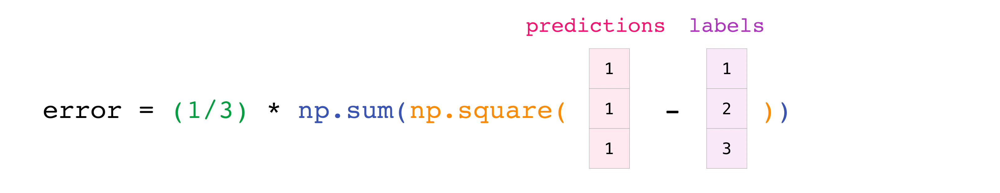

## Basic Mathematical Functions

The ease of implementing mathematical formulas that work on arrays is one of the things that make NumPy 
so widely used in the scientific Python community.

For example, this is the [mean squared error](https://en.wikipedia.org/wiki/Mean_squared_error) formula (a central formula used in supervised machine 
learning models that deal with regression):

$$ MeanSquaredError = \frac{1}{n}\sum_{i=1}^{n}(Yprediction_i - Y_i)^2 $$

Implementing this formula in NumPy is simple and straightforward:

```python
error = (1 / n) * np.sum(np.square(predictions - labels))
```

What makes this work so well is that `predictions` and `labels` can contain one or a thousand values. 
They only need to be the same size.

You can visualize it this way:



In this example, both predictions and labels vectors contain three values, which means that `n` has a value of three. 
After we carry out the subtractions, the values in the vector are squared. 
Then NumPy sums up the values, and your result is the error value for that prediction and the quality score of the model.

Here's a [list of mathematical functions](https://numpy.org/doc/stable/reference/routines.math.html) defined in the NumPy module.

### Task

In information theory, the [entropy](https://en.wikipedia.org/wiki/Entropy_(information_theory)) of a random variable is the average level of "information", "surprise", or 
"uncertainty" inherent in the variable's possible outcomes.
Given a discrete random variable $X$ with possible outcomes $x_{1},...,x_{n}$, which occur with the probability ${P} (x_{1}),...,{P} (x_{n})$, the entropy of $X$ is formally defined as:

$$H(X) = - \sum\limits_{i=1}^{n} P(x_i) \log P(x_i)$$

where $\Sigma$  denotes the sum over the variable's possible values and the choice of logarithm base varies between different 
applications. Base 2 gives the unit of bits. 

You are given a set of `probabilities` of 10 different values (outcomes). Use NumPy [math functions](https://numpy.org/doc/stable/reference/routines.math.html) and
the formula above (use base 2 for the logarithm) to implement the function `calculate_entropy`, which should return 
the entropy of the data. Do not round the answer.