## Linear Algebra

Matrices and matrix operations are used in the description of many machine learning algorithms due
to the efficiency of matrix solutions in ML problems.
NumPy [`numpy.linalg`](https://numpy.org/doc/stable/reference/routines.linalg.html)
functions provide efficient implementations of standard [linear algebra](https://en.wikipedia.org/wiki/Linear_algebra) algorithms:
operations with vectors and matrices. Vectors are 1D NumPy arrays, while matrices are 2D and nD arrays.

> <i>The SciPy library also contains the [`linalg`](https://docs.scipy.org/doc/scipy/reference/reference/linalg.html#module-scipy.linalg) 
> submodule, and there is an overlap in the functionality. SciPy contains some functions not found in `numpy.linalg`, and
> some functions that exist in both have augmented functionality in `scipy.linalg`.</i>

### Multiplying matrices

We already saw that an array can be modified **elementwise** by adding/subtracting or performing some other 
operation with a scalar or with another array of the same (or broadcastable) shape.
Matrix multiplication is a different and more complicated procedure.
It requires that the number of columns in the first matrix (A) is equal to the number of rows in the second matrix (B).
When performing matrix multiplication, we are calculating the [dot product](https://en.wikipedia.org/wiki/Dot_product) 
between each row in matrix A with each column in matrix B.

<figure>
  
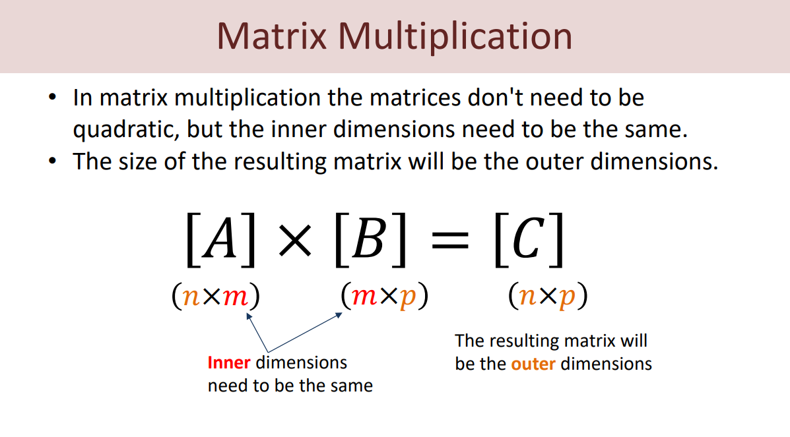
</figure>

One of the ways to calculate the product of two arrays using NumPy is the function [`numpy.dot(a, b)`](https://numpy.org/doc/stable/reference/generated/numpy.dot.html#numpy.dot).
It returns the dot product of arrays `a` and `b`. If `a` and `b` are both scalars or both 1D arrays, then 
a scalar is returned; otherwise, an array is returned. 

```python
a = np.array([[1, 1], [2, 2]])
b = np.array([[0, 10], [0, 10]])
print(np.dot(a, b))
```
Output:
```text
[[ 0 20]
 [ 0 40]]
```

<details>

There's also the [`numpy.matmul(a, b)`](https://numpy.org/doc/stable/reference/generated/numpy.matmul.html)
function (shorthand: `@`). `matmul` differs from `dot` in two important ways:

- Multiplication by scalars is not allowed.
- Stacks of matrices are broadcast together as if the matrices were elements (the methods behave differently when passed 3D or higher dimensional arrays, see the methods' docs for details).

For 2D arrays, the behavior is the same:
```python
a = np.array([[1, 2], [3, 4]])
b = np.array([[4, 5], [6, 7]])
print(a @ b)
```
Output:
```text
[[ 0 20]
 [ 0 40]]
```
</details>

Matrix multiplication is arguably the most important and widely used operation in machine learning.
It is used in linear regression, various kinds of neural networks, and other approaches.


<figure>
  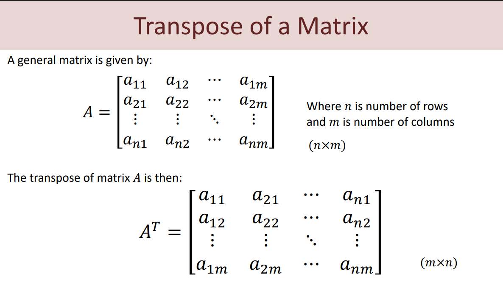
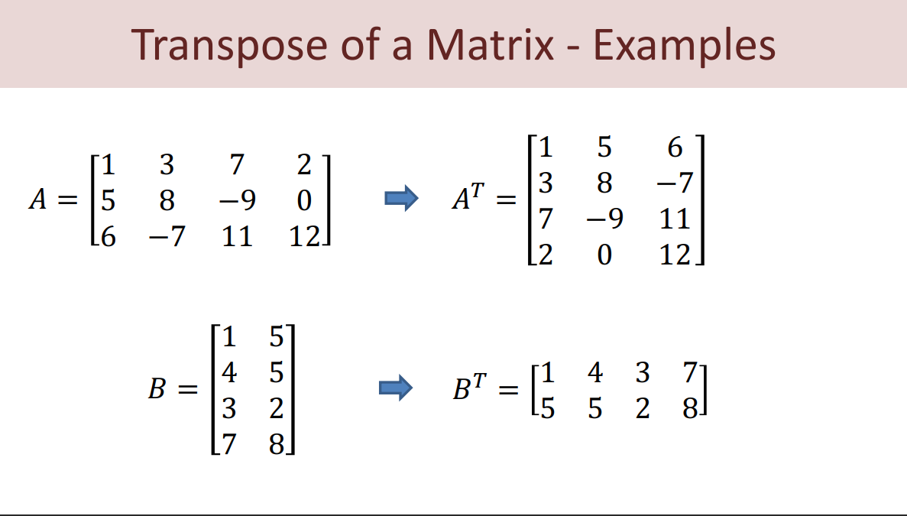
</figure>

```python
import numpy as np
A = np.array([[1, 3, 7, 2], 
[5, 8, -9, 0],
[6, -7, 11, 12]])
print("A="); print(A)
Atr = np.transpose(A)
print("Transpose of A="); print(Atr)
B = np.array([[1, 5], 
[4, 5],
[3, 2],
[7, 8]])
print("B="); print(B)
Btr = np.transpose(B)
print("Transpose of B="); print(Btr)

```

<figure>
  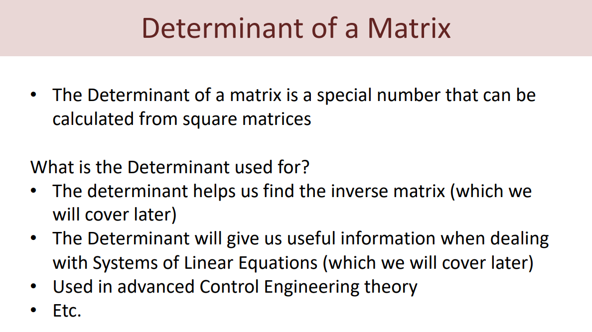
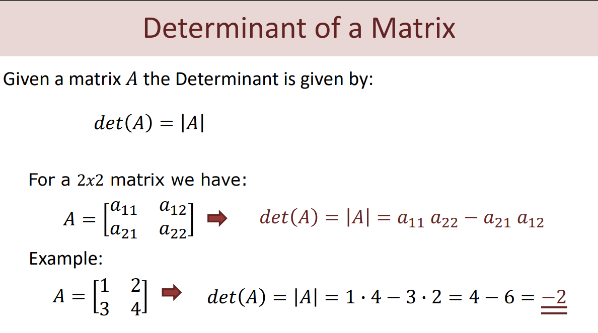
</figure>

```python

import numpy as np
import numpy.linalg as la
A = np.array([[1, 2], 
[3, 4]])
Adet = la.det(A)
print(Adet)
B = np.array([[-1, 3, 0],
[2, 1, -5],
[1, 4, -2]])
Bdet = la.det(B)
print(Bdet)
```

<figure>
  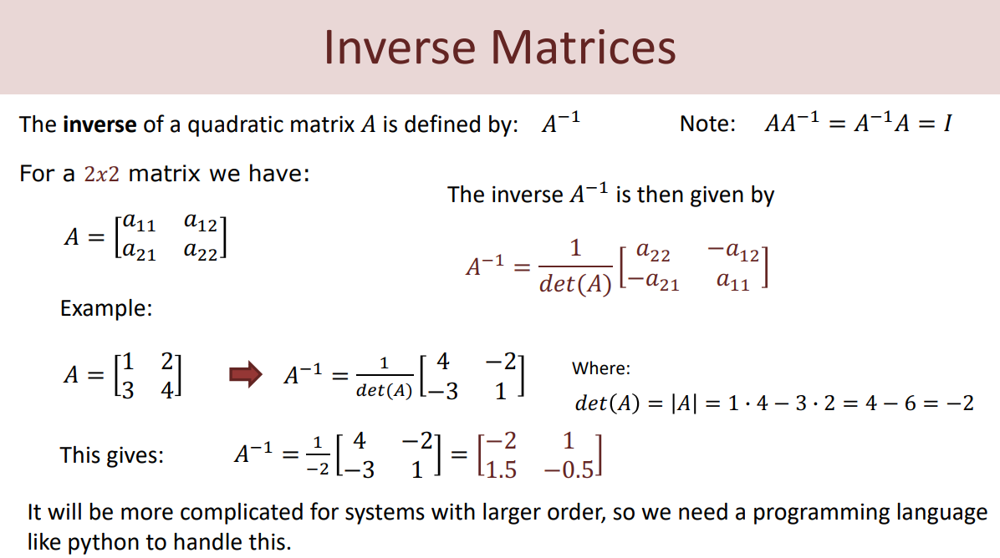
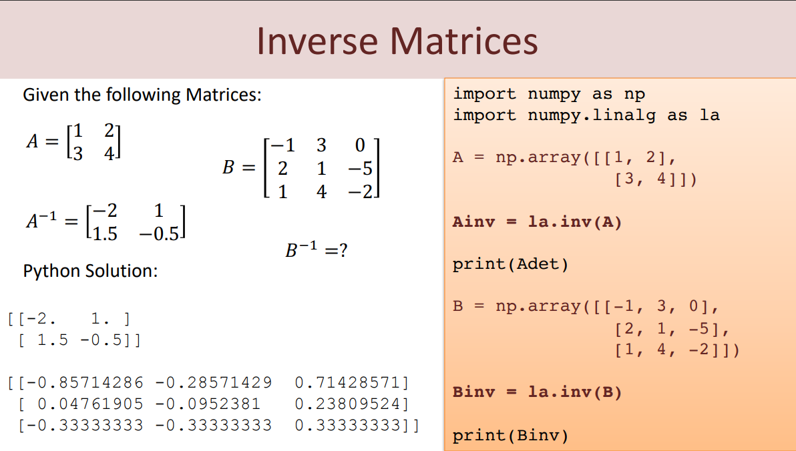
</figure>


<figure>
  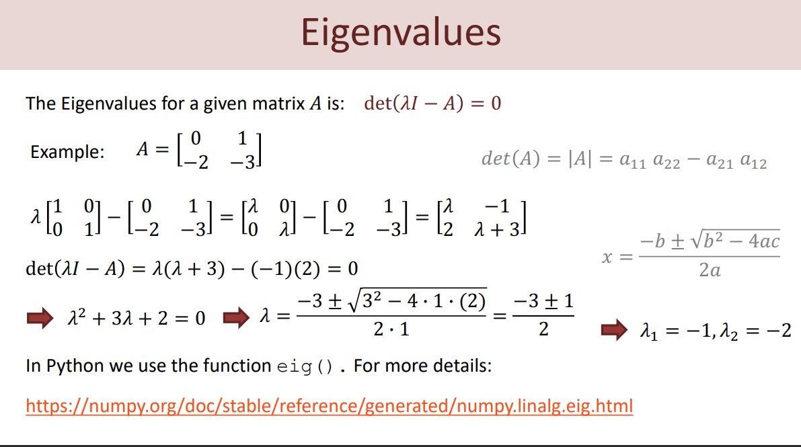
</figure>
<figure>
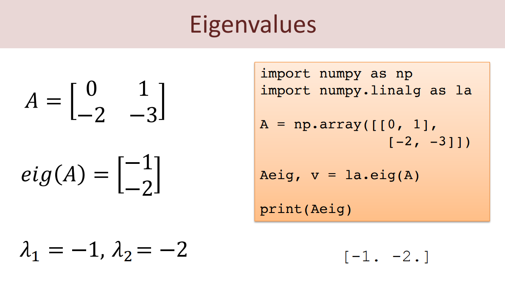
</figure>


<figure>
  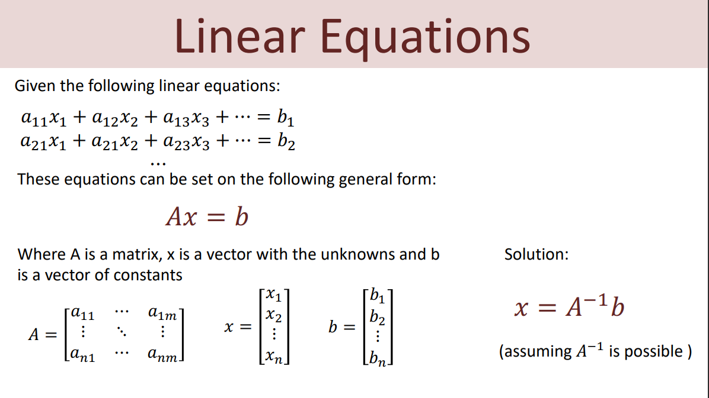
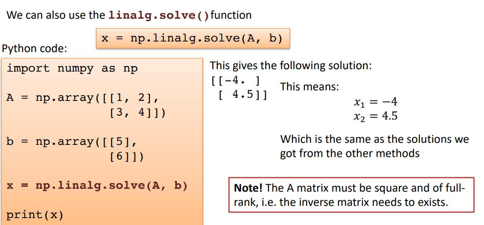
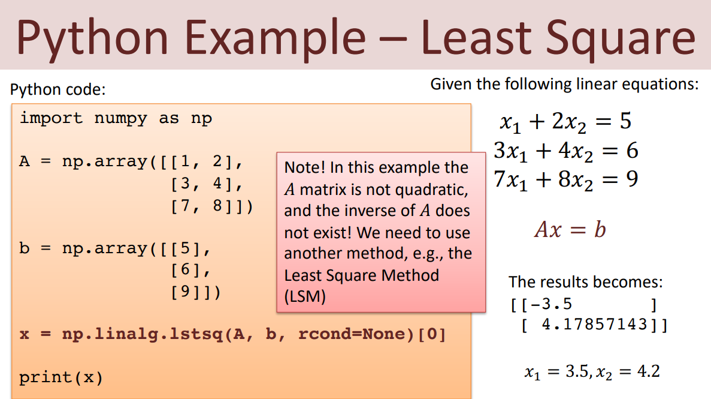
</figure>


<figure>
  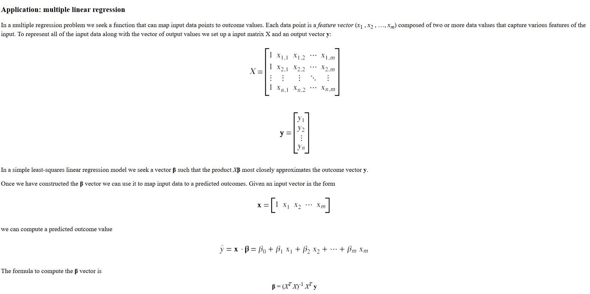
</figure>

```python
import csv
import numpy as np
import pandas as pd

df = pd.read_csv(r"C:\Users\stani\work\intro_python2\intro_to_python_class\Lesson 13 Numpy Array Math\Linear Algebra\California_Houses.csv")
num_rows_for_eval = 100
test_data = df[:-num_rows_for_eval]
eval_data = df[-num_rows_for_eval:]


y_test = test_data["Median_House_Value"]
# skip first column
x_test_df = test_data[test_data.columns[1:]]
X_test=x_test_df.to_numpy()

ones_vec = np.ones((X_test.shape[0],1))
X_test_new = np.concatenate((ones_vec,X_test),axis=1)

# Compute beta
Xt = np.transpose(X_test_new)
XtX = np.dot(Xt,X_test_new)
Xty = np.dot(Xt,y_test)
beta = np.linalg.solve(XtX,Xty)
print(beta)

# Make predictions for the last 10 rows in the data set
number_of_bad = 0
for idx, row in eval_data.iterrows():
         x_eval_df = row[row.index[1:]]
         X_eval=x_eval_df.to_numpy()
         X_eval_new = np.concatenate((np.ones((1,)),X_eval))
         prediction = np.dot(X_eval_new,beta)
         actual = row["Median_House_Value"]
         error = 100*abs(actual - prediction)/actual
         if error >20:
             error_quality = "BAD"
             number_of_bad +=1
         else:
            error_quality = "GOOD"
         print(f'prediction = {prediction} actual = {actual} error {error} quality_of_prediction {error_quality}')
print(f"number of bad {number_of_bad}")
```

### Task
A simple [feedforward neural network](https://en.wikipedia.org/wiki/Feedforward_neural_network)
consists of several layers of neurons, each of which represents a function that tweaks
input feature values in some way to produce the result. [Weights](https://en.wikipedia.org/wiki/Weighting) of the neurons are the values used to modify the
input data. Weights are the parameters that are adjusted during the training procedure, and they affect how well
the network performs. An [activation function](https://en.wikipedia.org/wiki/Activation_function) controls the amplitude of the output:
for example, the [sigmoid](https://en.wikipedia.org/wiki/Logistic_function) function used in this task produces the results on the interval from 0 to 1.

Let's pretend we have already trained a neural network with 2 layers and obtained
the weights of all the nodes which produce a decent result (`weights_layer1` and `weights_layer2`).
Test data (`csv`) is loaded from a file. Split it into arrays `values` and class `labels` (labels are in the last column).
Then complete the implementation of the function `predict`, which does the following:
- accepts the data and processes it on the first layer: $\sigma(X * W_1)$, where $X * W_1$ is the matrix product
of input data and weight arrays, and $\sigma$ is the sigmoid function;
- processes the result of the first layer on the second layer in the same way but using the other set of weights;
- returns the result in a form that can be directly compared with actual class labels.

The accuracy of your predictions will be printed if you run the script.

<div class="hint">Just implement the given formula. The <code>numpy.dot</code> function will be helpful for both steps in <code>predict</code>.</div>
<div class="hint">Data has to be processed by the sigmoid function in both steps.</div>