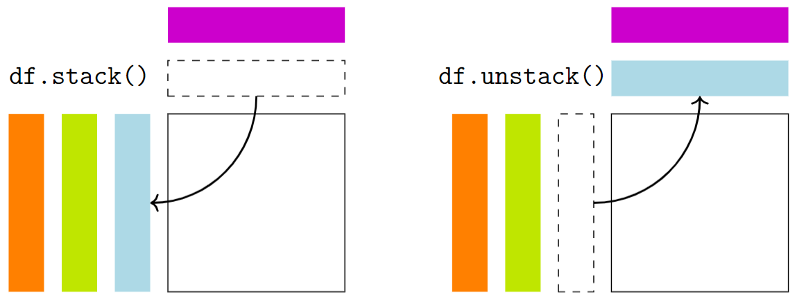

# Stacking and Unstacking Data

<p align="center">
    
</p>

## Stacking
In this example, the original DataFrame is stacked using the `stack()` method. The `dropna` parameter is set to `True` to drop missing values.

_Example:_
```python
import pandas as pd

# Sample DataFrame
data = {
    "Product": ["A", "B", "C"],
    "2022": [200, 150, 100],
    "2023": [210, 160, 110],
}

df = pd.DataFrame(data).set_index("Product")

print("Original DataFrame:")
print(df)

# Stacking the DataFrame
stacked_df = df.stack(dropna=True)

print("\nStacked DataFrame:")
print(stacked_df)
```
Output:
```
Original DataFrame:
         2022  2023
Product            
A         200   210
B         150   160
C         100   110
Stacked DataFrame:
Product      
A        2022    200
         2023    210
B        2022    150
         2023    160
C        2022    100
         2023    110
dtype: int64
```

## Unstacking
In the second example, the original DataFrame is unstacked using the `unstack()` method. The `level` parameter is set to `"Year"`, and the `fill_value` parameter is set to `0` to fill missing values with zeros.

_Example:_
```python
# Sample DataFrame
data = {
    "Product": ["A", "A", "B", "B", "C", "C"],
    "Year": [2022, 2023, 2022, 2023, 2022, 2023],
    "Sales": [200, 210, 150, 160, 100, 110],
}

df = pd.DataFrame(data).set_index(["Product", "Year"])

print("Original DataFrame:")
print(df)

# Unstacking the DataFrame
unstacked_df = df.unstack(level="Year", fill_value=0)

print("\nUnstacked DataFrame:")
print(unstacked_df)
```
Output:
```
Original DataFrame:
              Sales
Product Year       
A       2022    200
        2023    210
B       2022    150
        2023    160
C       2022    100
        2023    110
Unstacked DataFrame:
        Sales     
Year     2022 2023
Product           
A         200  210
B         150  160
C         100  110
```

## Task
1. Create a DataFrame from the data dictionary and set the index of the DataFrame to be a multi-level index containing "Product", "City", and "Year".
2. Unstack the DataFrame at the "Year" level and assign it to a new variable named `unstacked_df`.
